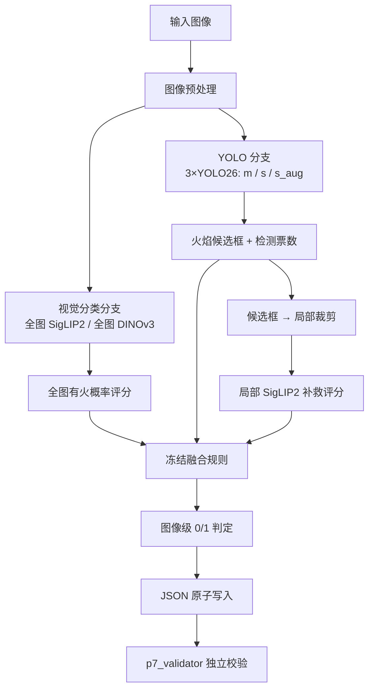

# 监控场景火情识别算法系统 — 项目概况与详细介绍

> 项目编号：SF-2026-01 · 更新日期：2026-08-28 · 本文档面向新成员、评委与技术人员
> 事实来源：官方任务书、`MODEL_CANDIDATE_REGISTRY.json`、终局封存资产、审计证据与源码。
> 本文档只新增 `PROJECT_OVERVIEW.md`，未改动任何生产代码、数据、权重或封存产物。

---

## 1. 项目标题

**监控场景火情识别算法系统**（图像级火焰检测，二分类：有火 / 无火）。

---

## 2. 一页式项目概况

这是一个面向算法竞赛的图像级火情识别项目：给定一张监控场景图片，判断其中是否出现火焰，
输出 `1`（有火）或 `0`（无火）。系统不是一个单独模型，而是一套**多模型融合**方案：
三个 YOLO26 目标检测模型（规模 m/s + 增强版 s_aug）负责生成火焰候选框，再结合全图
SigLIP2、全图 DINOv3 两个视觉编码器分类头，以及一个局部（裁剪）SigLIP2 补救头，按冻结的
阈值规则融合为整图 0/1 判定，最终产出以图片名为键、以 0/1 为值的 JSON 提交文件。

项目已完成：工程环境复现、指标独立复算、评测器与故障隔离的端到端关闭、内容簇隔离重训、
双候选工程彩排、权重 SHA-256 注册与回滚方案。当前项目状态为
`READY_FOR_EXTERNAL_PROMOTION_TEST`（具备外部晋升评测条件，但**尚非**正式提交就绪，
因官方测试集尚未发布）。

项目保留两个模型候选：历史默认模型 `LEGACY_ORIGINAL_WITH_KNOWN_LEAKAGE`（沿用至今，
但训练划分存在内容近邻泄漏），以及内容簇隔离重训的发布候选 `REG1_GROUPED_RC`。当前
**不晋升、不覆盖、不重新训练**。

---

## 3. 赛题背景与官方要求

### 3.1 任务背景

比赛要求在监控场景中判断图片是否出现火焰。官方提供的训练资源为约 1100 张监控图片，附带
两类标注：用于目标检测的 COCO 框标注（定位火焰框），以及用于整图判断的图像级 0/1 标注。

### 3.2 官方评估指标（口径必须准确）

官方文件明确列出的评估指标是**图像级 Precision 和 Recall**。

- 官方文件**没有**给出 F1、Precision/Recall 的合成公式，也没有给出二者权重；
- 因此本项目所有 F1 只作为**内部诊断指标**使用；
- 本项目**不生成**官方总分、排名或获奖概率。

> 注意：官方原文是"采用图像级 Precision 和 Recall"，并未出现"只/仅"字样。本文档不擅自
> 加"只使用 Precision 和 Recall"。

### 3.3 官方硬性要求（据任务书与 `REQUIREMENTS_MATRIX.md`）

| 编号 | 要求 | 对应内容 |
|---|---|---|
| R1/R2 | 图像输入入口 + 模型加载与可运行推理 | 接收单图或目录，加载模型并推理 |
| R3 | 图像级火/无火标签输出 | 只输出整数 0 或 1 |
| R4 | 严格 JSON 结果文件 | 以图片名为键、0/1 为值 |
| R5 | 可视化展示 | 上传图片、画框、展示分数 |
| R6 | 云端部署支持 | 可部署到云端并可访问 |
| R7 | 实用性与可部署性 | 方案可落地使用 |

官方要求的 JSON 格式示例：

```json
{ "xxx1.jpg": 0, "xxx2.jpg": 1 }
```

---

## 4. 项目目标与功能范围

**目标**：为官方测试集生成合法、完整的图像级 0/1 JSON 提交，并提供可复现的推理与评估链路。

**当前实际完成范围**（据终局封存状态）：

- ✅ 工程环境已复现（Python 3.11 + torch cu128 + 推理依赖全部锁定）；
- ✅ 图像级指标可从冻结产物复算（与历史记录一致）；
- ✅ 评测器与故障隔离已端到端关闭；
- ✅ 内容簇隔离训练与一次性 holdout 评估已完成；
- ✅ 两个候选均完成 canonical 1100 图的提交链工程彩排；
- ⏳ 正式测试集 JSON 尚未生成（测试集未发布）；
- ⏳ 云端部署与可视化系统未入库（仅文档描述，见第 17 节）。

---

## 5. 系统架构



说明：节点名称以 `src/predict_best_fusion.py` 为准。YOLO 分支产出检测票数与候选框；视觉
分类分支产出全图概率；候选框送入局部 SigLIP2 做小目标补救；三路结果经冻结阈值规则融合为
整图 0/1；最终 JSON 原子写入，再由独立校验器复核。

---

## 6. 仓库结构与关键文件

> 以下均为仓库相对路径（不含个人绝对路径）。

```
AI/
├── fire_detection/                 # 生产项目（源码、数据、权重、输出）
│   ├── src/                        # Python 源码
│   │   ├── predict_best_fusion.py  # 核心融合推理入口
│   │   ├── evaluate_image_level.py # 图像级评测器（G3 修复后）
│   │   ├── batch_safety.py         # 单图故障隔离 + PARTIAL 纪律（G4）
│   │   ├── train.py                # YOLO 训练脚本
│   │   ├── train_siglip2_classifier.py / train_dinov3_classifier.py  # 分类头训练
│   │   ├── build_yolo_crop_dataset.py  # 局部补救训练数据构建
│   │   └── coco_to_yolo.py / dataset.py / inference.py / ...          # 数据转换与工具
│   ├── data/                       # 官方数据与 YOLO 格式数据（images/train/、train/、val/）
│   ├── runs/                       # YOLO 训练记录与权重（LEGACY）
│   ├── runs_siglip/ runs_dinov3/   # 分类头权重与训练记录（LEGACY）
│   ├── outputs/                    # 验证真值、预测、阈值搜索与指标
│   ├── scripts/                    # PowerShell 训练/推理/提交脚本
│   └── requirements.txt            # 基础依赖说明
├── hf_cache/                       # SigLIP2 / DINOv3 骨干模型缓存（离线推理必需）
├── external_datasets/              # 外部数据集（如 DFire，未用于最终模型训练）
├── audit/competition_review/       # 全部审计与整改资产
│   ├── FINAL_AUDIT_REPORT.md       # 原始审计报告
│   ├── POST_REMEDIATION_AUDIT.md   # R1/R2 整改后复审
│   ├── POST_G1_REMEDIATION_AUDIT.md# G1/G2 整改后复审
│   ├── MODEL_CANDIDATE_REGISTRY.json  # 双候选注册表（12 权重 SHA）
│   ├── FINAL_PROJECT_STATUS.md     # 终局状态
│   ├── CANDIDATE_COMPARISON.md     # 双候选对比与评分
│   ├── PROMOTION_GATE_PLAN.md      # 晋升门槛方案
│   ├── PRODUCTION_SWITCH_AND_ROLLBACK.md  # 切换与回滚方案
│   ├── machine/                    # 机器可读状态（final_candidate_status.json 等）
│   ├── remediation_g1/             # REG1 训练产物（formal_runs/、runs_heads/、REG1_ASSETS.json）
│   ├── remediation_g2/             # G2 校准 + holdout 评估结果
│   ├── remediation_g6_original/    # 原模型 G6 彩排产物
│   └── remediation_g6_grouped/     # REG1 模型 G6 彩排产物
└── 00_先看我_AI项目导航.md         # 早期项目导航（部分路径为历史 C:\AI，已失效）
```

**恢复入口**：`audit/competition_review/FINAL_PROJECT_STATUS.md` 与
`machine/final_candidate_status.json` 是终局状态；`MODEL_CANDIDATE_REGISTRY.json` 是双候选
权威注册表。

---

## 7. 数据、标注与数据划分

### 7.1 数据规模与语义

- **canonical 数据规模**：1100 张图片（官方冻结，`p7_validator` 的 canonical 清单）。
- **磁盘文件数**：1101（含 1 张与 canonical 中某图字节相同的 `(1)` 副本，被显式排除）。
- **两类标注**：
  - `train_coco.json`：目标检测框标注（火焰框，用于训练 YOLO）；
  - `train_image.json`：图像级 0/1 标注（整图是否有火，最接近比赛答案格式）。
- **正类语义**：`1` = 存在火焰；`0` = 无火。

### 7.2 旧划分（LEGACY）与泄漏问题

历史训练使用 **880 训练 / 220 验证** 的划分。审计通过内容感知哈希（dHash，一种对图片缩放到
8×8 灰度后逐像素比较的感知哈希）发现该划分存在**内容近邻泄漏**：验证集与训练集之间有
22 对图片 dHash 距离为 0，38.6% 的图片对 dHash≤8。这意味着旧划分的验证集并非严格独立，
其上的指标会**系统性偏乐观**。

> 术语澄清：dHash=0 表示两张图的感知哈希完全相同，**不等于** SHA-256 字节完全一致；
> 它是"内容高度相似"的强信号，而非"逐字节相同"。

### 7.3 新划分（REG1）与内容簇隔离

REG1 使用内容簇隔离的三集划分（据 `remediation_g1/split/SPLIT_FREEZE.json`）：

| 集合 | 数量 | 用途 |
|---|---|---|
| train（训练） | 698 | 训练 YOLO 与分类头 |
| calibration（校准） | 198 | 分类头早停/验证 + 诊断面板 |
| final holdout（最终保留） | 146 | 只评估一次，报告可信指标 |
| quarantine（隔离） | 58 | 边界带的近邻图片，不参与任何训练/评估 |

隔离方法：对全部 1100 张图计算 dHash64，按 hamming 距离 ≤8 做并查集聚类（共 773 簇），
整簇归属同一侧；簇边界带（d∈(8,12]）的 32 对图片全部隔离。重划后**跨集 dHash≤8 连接数
= 0**。

> 诚实说明：REG1 的隔离解决的是**本轮的内容近邻泄漏**，属于同一来源数据的内部验证，
> **不等于**真正外部目标域验证。此外，REG1 与 LEGACY 的性能差异不能全部归因于"去泄漏"，
> 因为训练样本量与评估分布也发生了变化。

---

## 8. 模型组成与融合策略

### 8.1 模型组成

| 模型 | 角色 |
|---|---|
| YOLO26m / YOLO26s / YOLO26s_aug | 目标检测，产出火焰候选框与检测票数（m/s 为规模差异，s_aug 为增强训练） |
| 全图 SigLIP2 线性头 | 全图视觉编码，判断整图有火概率 |
| 全图 DINOv3 线性头 | 全图视觉编码，作为否决/佐证分支 |
| 局部 SigLIP2 补救头 | 对 YOLO 候选框裁剪后做小目标高置信补救 |

完整骨干模型（SigLIP2、DINOv3）位于 `hf_cache/`，分类头文件本身很小（只存最后的线性层）。

### 8.2 融合规则（冻结阈值，据 `predict_best_fusion.py` 与注册表）

```
base = (YOLO26m OR YOLO26s OR YOLO26s_aug 至少一票)
       AND 全图 SigLIP2 >= 0.22
       AND 全图 DINOv3  >= 0.08

final = base OR (局部 SigLIP2 >= 0.97)   # 局部高置信补救
```

即：三个 YOLO 中任一检测到火焰、且两个全图视觉模型都给出足够置信，判为有火；否则若局部
裁剪的 SigLIP2 给出 ≥0.97 的高置信，也判为有火。相关阈值（0.22/0.08/0.97/0.03 候选框置信/
IoU 0.45/最大候选框 8/imgsz 960）均已冻结，推理过程中不改变。

---

## 9. 训练与冻结协议（REG1）

REG1 的正式训练遵循严格冻结协议（据 `remediation_g1/REG1_ASSETS.json` 与
`machine/g1_controller_status.json`）：

- **数据划分冻结**：train 698 / calib 198 / holdout 146 / quarantine 58，跨集 dHash≤8=0；
- **训练用途**：train 训练；calib 仅作分类头早停/验证；holdout 在最终评估前完全不读取；
- **final holdout 只开启一次**：以锁文件保证；
- **checkpoint、规则、阈值在开启 holdout 前冻结**（SHA-256 记录）；
- **quarantine 不参与任何训练或评估**；
- **三个 YOLO**：m 80 轮 / s 74 轮（早停）/ s_aug 80 轮，随机种子 0，严格沿用历史
  `args.yaml`（batch=4/8、imgsz=960、deterministic、amp、增广一致）；
- **三个分类头**：siglip（seed 2026）、dino（seed 42）、crop（seed 2026），沿用生产
  hyperparameter（epochs 100 / patience 15 / lr 1e-3 / dropout 0.2）；
- **训练耗时**：三个 YOLO 累计约 3.93 GPU 小时（预算 12 小时内）；
- **权重 SHA-256**：每个模型/头的 `best.pt` / `best_head.pt` 均记录 SHA-256，用于后续
  一致性校验，防止混装或篡改；
- **为什么不自动覆盖 LEGACY**：REG1 虽评估协议更严格，但仍是同源数据、无外部验证，
  且"指标更可信"不等于"隐藏测试集表现一定更好"，因此只标记为发布候选，不自动替换默认模型。

---

## 10. LEGACY 与 REG1 双候选

项目并存两个完整模型候选，二者证据**完全分开**，不拼接：

### LEGACY_ORIGINAL_WITH_KNOWN_LEAKAGE

- 当前仍是**默认模型**；
- 工程链可运行，历史结果可从冻结产物复算；
- 旧训练—验证划分存在内容近邻泄漏，F-11 状态 = `CONFIRMED/UNRESOLVED`；
- 历史 P/R/F1 **不能**作为无偏陌生场景泛化证据；
- **不因数值较高就称其优于 REG1**。

### REG1_GROUPED_RC

- 状态 = `RELEASE_CANDIDATE`（发布候选）；
- **尚未晋升、尚未覆盖生产权重**；
- 使用内容簇隔离训练与评估协议，F-11 对 REG1 标记为 `CLOSED_FOR_REG1`；
- 有可信的内容簇隔离 holdout 指标；
- 仍属同一来源数据，**不能冒充**真正外部目标域验证。

---

## 11. 指标与评估结果

### 11.1 双候选对比表

| 项 | LEGACY_ORIGINAL_WITH_KNOWN_LEAKAGE | REG1_GROUPED_RC |
|---|---|---|
| 角色 | 默认生产模型 | 发布候选 |
| 数据范围 | 历史 220 验证（受污染） | 隔离 holdout 146（无泄漏） |
| Precision | 0.9474 | 0.8462 |
| Recall | 0.9818 | 0.9340 |
| F1（诊断性） | 0.9643 | 0.8879 |
| 95% CI | 未报告 | P[0.7949, 0.8974] R[0.90, 0.9706] |
| 数据泄漏状态 | CONFIRMED/UNRESOLVED | CLOSED_FOR_REG1 |
| 工程 G6 状态 | PASS | PASS |
| 可作无偏泛化证据 | 否 | 是（同源、非外部） |
| 内部就绪度 | 39/100（泄漏封顶） | 57/100 |
| 是否默认 | 是 | 否 |

### 11.2 REG1 holdout 混淆矩阵自检

REG1 holdout 混淆矩阵：TP=99, FP=18, FN=7, TN=22。

- 样本数核对：99 + 18 + 7 + 22 = **146** = holdout 数量 ✓
- Precision = 99/(99+18) = 0.8462 ✓
- Recall = 99/(99+7) = 0.9340 ✓
- F1 = 2×0.8462×0.9340/(0.8462+0.9340) = 0.8879 ✓

### 11.3 为什么 LEGACY 数值更高但不可信

- LEGACY 的 0.9474/0.9818 来自受内容近邻泄漏污染的 220 验证集，验证集与训练集存在
  高度相似的图片，指标系统性偏乐观；
- REG1 的 0.8462/0.9340 来自隔离 holdout，验证图片与训练图片在内容簇上互斥，更能反映
  陌生场景的泛化；
- 因此 **LEGACY 数值更高但不代表更优**；REG1 的"指标更可信"也**不等于**隐藏测试集一定更好。

### 11.4 重要区分

- **LEGACY 主结果**（0.9474/0.9818）与 README 中"应用全图补救"的探索结果（0.9480/0.9939）
  是两回事，不能混写；
- F-15 探索规则（全图 SigLIP2≥0.85 且 DINOv3≥0.70）只作为**探索性规则**，不作为正式
  生产最优规则。

---

## 12. 数据泄漏问题与整改

- **发现**：审计用 dHash 内容哈希发现旧 880/220 划分存在内容近邻泄漏（22 张 d=0、
  38.6% d≤8），把泄漏从"模式"升级为"硬证据"。
- **整改**：构建内容簇隔离三集划分（698/198/146+58），跨集 dHash≤8=0，并重训 REG1。
- **F-11 结论**：LEGACY = `CONFIRMED/UNRESOLVED`；REG1 = `CLOSED_FOR_REG1`（仅对 REG1）。
- **边界说明**：不使用"彻底解决所有数据泄漏"这类超范围表述；REG1 解决的是本轮内容簇
  泄漏，仍属同源数据。

---

## 13. 工程可靠性整改

区分"代码修复"与"端到端关闭"：

### G3 / F-12：评测器全集口径修复

原评测器在"交集口径"下可能抬高 Recall（缺失的真阳性预测不被计入分母）。已重写
`evaluate_image_level.py`：

- 缺失预测不再通过交集口径抬高 Recall（fail-closed，缺图计入 FN）；
- 严格 JSON 解析（拒绝重复键、NaN/Inf、类型陷阱）；
- 现存旧产物因本身"全覆盖"而未受影响（这就是历史数字未变的原因），但生产代码缺陷仍
  必须修复，否则未来缺图时会虚高。

### G4 / F-14：单图故障隔离

新增 `batch_safety.py`，使单个坏图不再中断整批：

- 每图异常隔离（load_preprocess / inference / fusion 三阶段）；
- 失败时产出 `_PARTIAL.json` + `_failures.json`，**不写正式提交名**；
- 原子写入（临时文件 + `os.replace`）；
- 非零退出码（3）；
- `p7_validator` 拒绝不完整提交（fail-closed）。

### 端到端复验结果（真实前向，据 R3）

- G3：220 图全链输出与历史指标**逐字节一致**（TP162/FP9/FN3/TN46，P0.9474/R0.9818）；
- G4：截断坏图注入 → rc=3、PARTIAL 仅含正常图、validator 拒收 —— 均已 CLOSED。

---

## 14. 环境、性能与资源

据冻结环境文件 `remediation_r2b/frozen_requirements.txt` 与 G7 实测：

| 项 | 值 |
|---|---|
| Python | 3.11.9 |
| PyTorch | 2.8.0+cu128（CUDA 12.8 构建） |
| torchvision | 0.23.0+cu128 |
| Ultralytics | 8.4.87 |
| transformers | 5.16.1 |
| timm | 1.0.28 |
| GPU | RTX 5060 Laptop，compute capability 12.0（sm_120），8151 MiB |
| 冷启动（含权重加载+12 图） | 59.08 秒 |
| 暖机 12 图总耗时 | 28.22 秒（约 2.35 秒/图） |
| 单图全链上界（含每阶段权重重载） | 19.71 秒 |
| 峰值显存 | torch 分配 1777 MiB / nvidia-smi 5181 MiB |
| 峰值温度 | 59°C |

> 所有数值均为 RTX 5060 Laptop 本机实测，**不泛化**为云端或其他 GPU 的性能。

---

## 15. 提交 JSON 与校验器

### 15.1 JSON 结构与 canonical 1100

- 提交 JSON 结构：`{ 图片名: 0|1 }`，键为图片文件名，值为整数 0 或 1；
- canonical 清单为 1100 张图片（`p7_validator` 冻结，排除 1 张字节重复的 `(1)` 副本）。

### 15.2 两个 surrogate 彩排（工程链验证）

- LEGACY G6：原模型跑 1100 图 → JSON → validator PASS（标记
  `ORIGINAL_MODEL_WITH_KNOWN_LEAKAGE`）；
- REG1 G6：新模型跑 1100 图 → JSON → validator PASS（标记 `GROUPED_MODEL_REG1_RETRAINED`）。

### 15.3 p7_validator 的作用

独立校验器检查：键数量是否恰为 canonical 数、是否缺失/额外/重复键、值是否非法类型、
是否含 NaN/Inf、是否存在损坏文件等，任何问题 fail-closed。

### 15.4 为什么 surrogate 通过 ≠ 正式提交就绪

surrogate 彩排使用的是 canonical 1100 训练资源图，用于验证**工程提交链**（命名、覆盖、
类型、退出码、原子写），**不是**官方测试集提交。官方测试集到位后仍需：放入测试图片 →
生成 JSON → 校验键数/类型 → 抽查 → 按平台要求一并提交模型、代码与可视化地址。

---

## 16. 当前完成度和就绪状态

| 项 | 状态 |
|---|---|
| 工程环境 | 已复现 |
| G3 / G4 | 端到端 CLOSED |
| LEGACY | 工程可运行，但无可信无泄漏泛化指标 |
| REG1 | 工程可运行，有内容簇隔离指标，状态 = `RELEASE_CANDIDATE` |
| 正式提交 | 等待官方测试集 |
| 生产权重 | 尚未切换（LEGACY 仍为默认） |
| 当前项目状态 | `READY_FOR_EXTERNAL_PROMOTION_TEST`（**非** `SUBMISSION_READY`） |

---

## 17. 已知限制与风险

**已经完成**：

- 环境复现；
- 指标独立复算（与历史记录一致）；
- G3/G4 端到端关闭；
- 内容簇隔离训练与验证；
- 双模型 G6 工程彩排；
- 双候选权重注册、SHA-256 与回滚方案；
- 项目终局封存。

**尚未完成或未充分验证**：

- 外部目标域验证（当前只有同源隔离验证）；
- 官方测试集正式 JSON（测试集未发布）；
- REG1 正式晋升（未执行）；
- 真正云端部署（仅文档描述，仓库内无实物，历史指向的部署目录已不存在）；
- 完整可视化系统（同上，仓库内无实物）；
- 不同硬件上的性能；
- 官方未公布 P/R 的合成权重或综合公式。

> 明确："文档中存在方案"不等于"已部署完成"。可视化/云端部署当前只有文档描述，仓库内
> 无可查实物，评审无法从提交物内直接看到。

---

## 18. 模型晋升条件

REG1 不得仅凭"评估更诚实"自动覆盖 LEGACY。正式晋升至少需满足 `PROMOTION_GATE_PLAN.md`
中的 A 或 B 之一：

- **门槛 A：外部目标域配对比较** —— 在与两套模型训练数据均无内容重叠、有可靠标签的外部
  数据上，用冻结规则对两候选配对比较；
- **门槛 B：官方测试集到位** —— 依据比赛允许的提交与选择规则获得可比较证据。

外部比较必须：推理前冻结数据清单/标签/两套权重/规则；做 SHA 与 dHash 内容重叠审计；
两候选用同一数据、同一规则配对比较；同时报告 TP/FP/FN/TN/P/R；对 P、R 及二者差值给出配对
bootstrap CI；报告失败率、延迟、显存。**若 P/R 存在权衡，因官方未公布合成权重，必须由
用户决策，禁止用 F1 擅自选择**。

> 若官方测试集没有标签、且比赛不返回可比较指标，它不能单独完成模型优劣比较。外部评测
> 数据（如 DFire）在许可与来源未核实前，不得直接用作晋升依据。

晋升应使用**版本化、原子切换、可回滚**方案（见 `PRODUCTION_SWITCH_AND_ROLLBACK.md`），
禁止直接覆盖同名权重。

---

## 19. 复现与使用指南

> 下述命令均来自 `COMMANDS.md` 与 README，且经过实际运行验证。未经验证的命令不予编造。

### 19.1 环境

已冻结环境：`C:\fire_envs\sf2026_min`（Python 3.11.9，依赖锁定于
`audit/competition_review/remediation_r2b/frozen_requirements.txt`）。激活后可直接运行
生产推理入口。生产入口 `predict_best_fusion.py` 默认路径仍指向历史失效的 `C:\AI`，因此
**必须用显式 CLI 传入全部权重/缓存路径**（详见 `PRODUCTION_SWITCH_AND_ROLLBACK.md`）。

### 19.2 最小推理与 JSON 生成

请参考 `fire_detection/scripts/predict_best_fusion_crop.ps1` 与
`fire_detection/src/predict_best_fusion.py`（入口），配合显式权重路径调用。核心参数：
`--source`（单图或目录）、`--output`（JSON 路径）、以及 6 个权重路径与 `--cache-dir`。

### 19.3 运行 p7_validator

独立校验器位于 `audit/competition_review/scripts/p7_validator.py`，用法见
`VALIDATOR_README.md`。`validate` 命令校验提交 JSON 结构；`preflight-images` 命令检查
源图集是否有损坏文件。

### 19.4 查看候选注册表与恢复状态

- 双候选注册表：`audit/competition_review/MODEL_CANDIDATE_REGISTRY.json`
- 终局状态：`audit/competition_review/FINAL_PROJECT_STATUS.md` 与
  `audit/competition_review/machine/final_candidate_status.json`
- REG1 资产：`audit/competition_review/remediation_g1/REG1_ASSETS.json`

---

## 20. 关键证据与资产索引

| 资产 | 路径 |
|---|---|
| 双候选注册表 | `audit/competition_review/MODEL_CANDIDATE_REGISTRY.json` |
| 终局状态（机器可读） | `audit/competition_review/machine/final_candidate_status.json` |
| 双候选对比与评分 | `audit/competition_review/CANDIDATE_COMPARISON.md` |
| 晋升门槛方案 | `audit/competition_review/PROMOTION_GATE_PLAN.md` |
| 切换与回滚方案 | `audit/competition_review/PRODUCTION_SWITCH_AND_ROLLBACK.md` |
| REG1 权重与 SHA | `audit/competition_review/remediation_g1/REG1_ASSETS.json` |
| REG1 数据划分冻结 | `audit/competition_review/remediation_g1/split/SPLIT_FREEZE.json` |
| REG1 训练控制器状态 | `audit/competition_review/machine/g1_controller_status.json` |
| 冻结环境 | `audit/competition_review/remediation_r2b/frozen_requirements.txt` |
| 原始审计报告 | `audit/competition_review/FINAL_AUDIT_REPORT.md` |
| 证据索引 | `audit/competition_review/EVIDENCE_INDEX.md` |
| 需求矩阵 | `audit/competition_review/REQUIREMENTS_MATRIX.md` |

---

## 21. 术语表

| 术语 | 含义 |
|---|---|
| 图像级二分类 | 整张图片只输出 0（无火）或 1（有火） |
| COCO 框标注 | 目标检测框标注，定位火焰框位置 |
| 图像级标注 | 整图有无火的 0/1 标注 |
| YOLO26m/s/s_aug | 三个 YOLO26 目标检测模型（规模 m/s、增强训练 s_aug） |
| SigLIP2 / DINOv3 | 两种视觉编码器，用于整图有火概率判断 |
| 线性分类头 | 在冻结骨干特征上的小分类器（best_head.pt） |
| 融合规则 | 将多模型结果合并为整图 0/1 的阈值规则 |
| dHash | 感知哈希，把图片缩放到 8×8 灰度后逐像素比较，衡量内容相似度 |
| 内容簇隔离 | 按 dHash 聚类，把内容相似的图片整体归入同一划分 |
| quarantine | 隔离区，边界带近邻图片，不参与训练/评估 |
| holdout | 最终保留集，只评估一次，报告可信指标 |
| canonical | 冻结的 1100 张官方图片清单 |
| surrogate | 用训练资源图做的工程彩排，非官方提交 |
| fail-closed | 出错时拒绝通过而非静默放行 |
| READY_FOR_EXTERNAL_PROMOTION_TEST | 具备外部晋升评测条件（非提交就绪） |
| RELEASE_CANDIDATE | 发布候选（未晋升） |
| SHA-256 | 文件内容指纹，用于一致性校验 |

---

## 口径说明（冲突记录）

早期文档（`00_先看我_AI项目导航.md`、`fire_detection/README.md`）仍记录历史 `C:\AI` 绝对
路径、旧 880/220 划分、以及"当前应用验证结果 0.9480/0.9939"等表述。这些早于终局封存。
本概览以**较晚且证据等级更高的终局封存资产**（`MODEL_CANDIDATE_REGISTRY.json`、
`machine/final_candidate_status.json`、`FINAL_PROJECT_STATUS.md`）为准：默认模型为 LEGACY，
REG1 为发布候选，主验证指标为 0.9474/0.9818（LEGACY，受泄漏）与 0.8462/0.9340（REG1，
隔离 holdout）。README 中的 0.9480/0.9939 属于含"应用全图补救"探索规则的结果，不作为
正式生产主指标。
